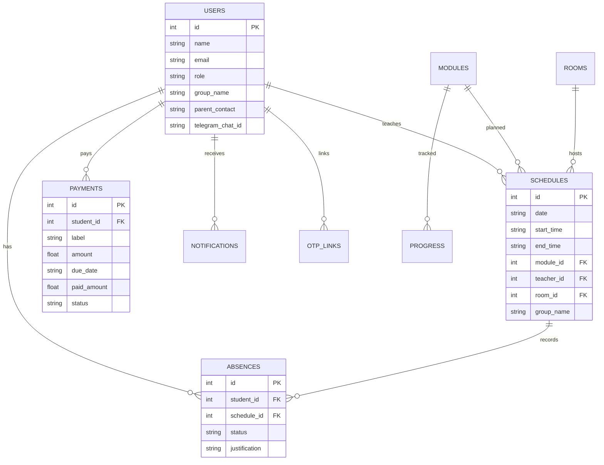
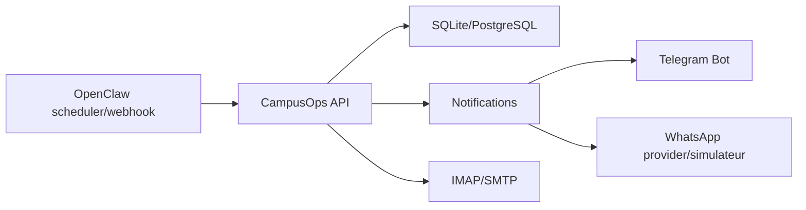

# Diagrammes - CampusOps

## ERD

```mermaid
erDiagram
  USERS ||--o{ SCHEDULES : teaches
  USERS ||--o{ ABSENCES : has
  USERS ||--o{ PAYMENTS : pays
  USERS ||--o{ NOTIFICATIONS : receives
  USERS ||--o{ OTP_LINKS : links
  MODULES ||--o{ SCHEDULES : planned
  MODULES ||--o{ PROGRESS : tracked
  ROOMS ||--o{ SCHEDULES : hosts
  SCHEDULES ||--o{ ABSENCES : records

  USERS {
    int id PK
    string name
    string email
    string role
    string group_name
    string parent_contact
    string telegram_chat_id
  }
  SCHEDULES {
    int id PK
    string date
    string start_time
    string end_time
    int module_id FK
    int teacher_id FK
    int room_id FK
    string group_name
  }
  ABSENCES {
    int id PK
    int student_id FK
    int schedule_id FK
    string status
    string justification
  }
  PAYMENTS {
    int id PK
    int student_id FK
    string label
    float amount
    string due_date
    float paid_amount
    string status
  }
```

## Flux OpenClaw

```mermaid
flowchart LR
  OpenClaw["OpenClaw scheduler/webhook"] --> API["CampusOps API"]
  API --> DB["SQLite/PostgreSQL"]
  API --> N["Notifications"]
  N --> Telegram["Telegram Bot"]
  N --> WhatsApp["WhatsApp provider/simulateur"]
  API --> Mail["IMAP/SMTP"]
```
